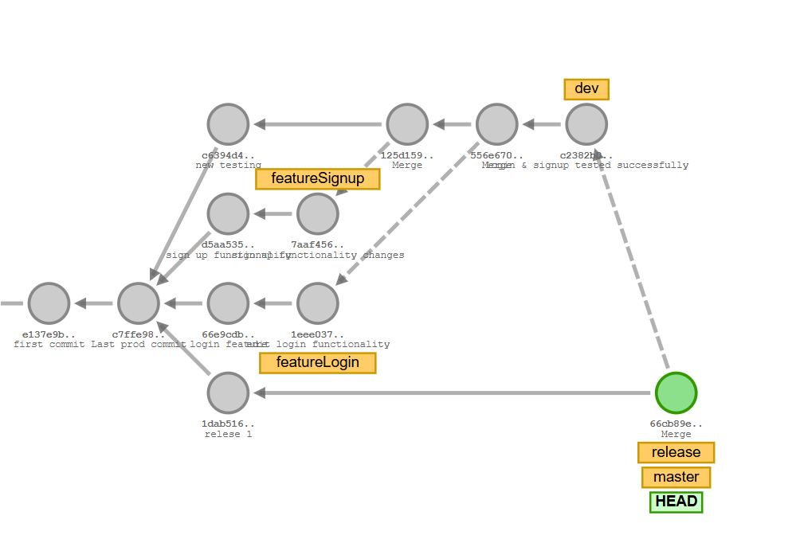
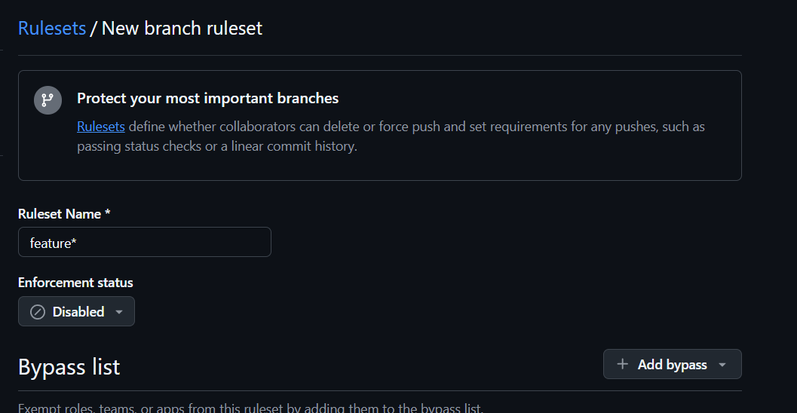
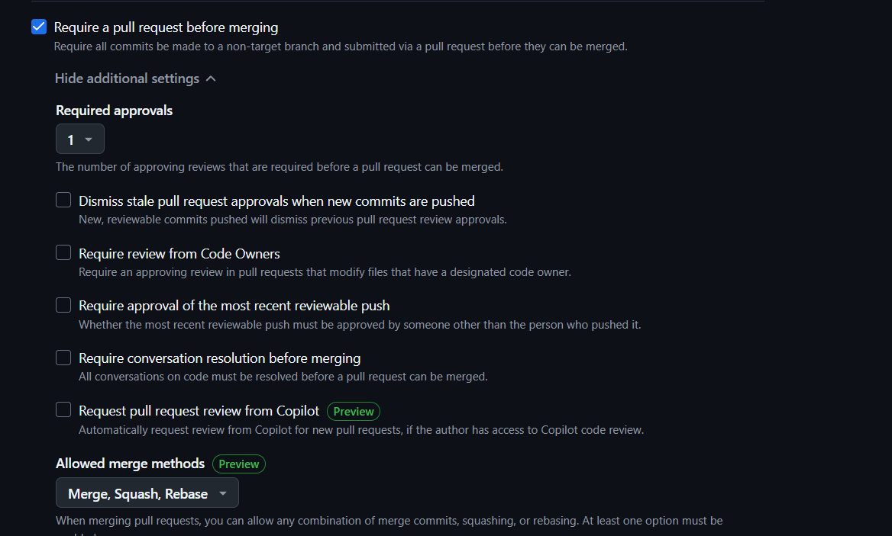
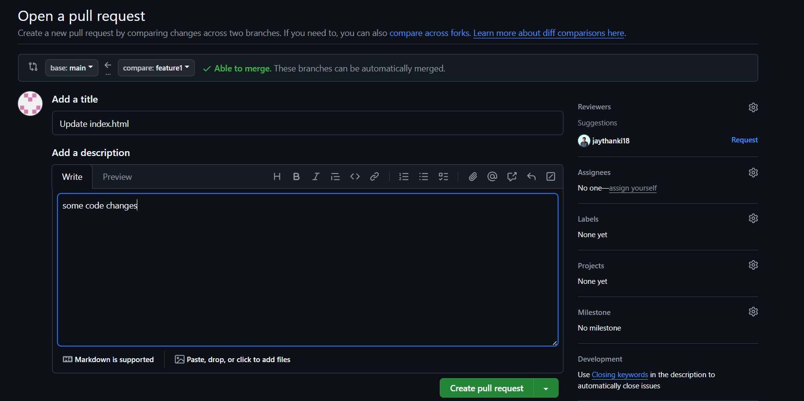
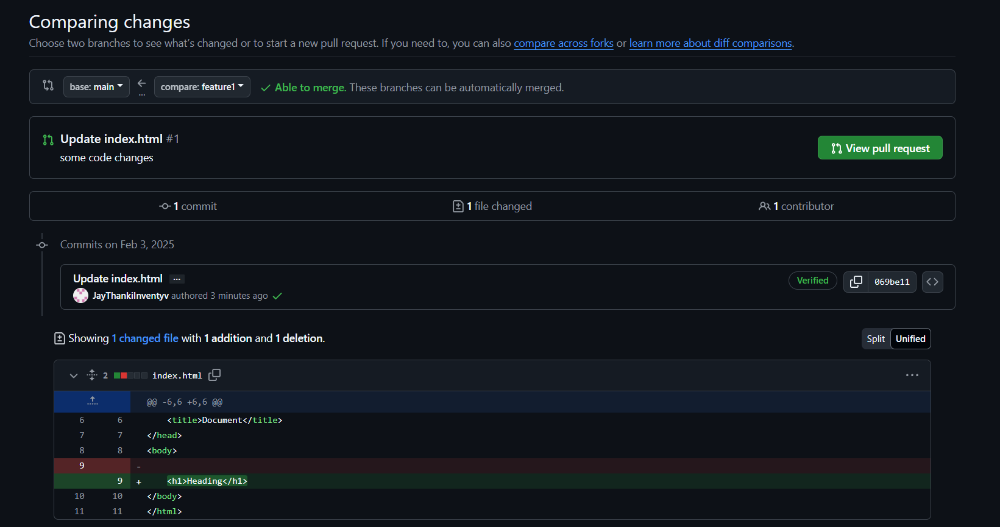
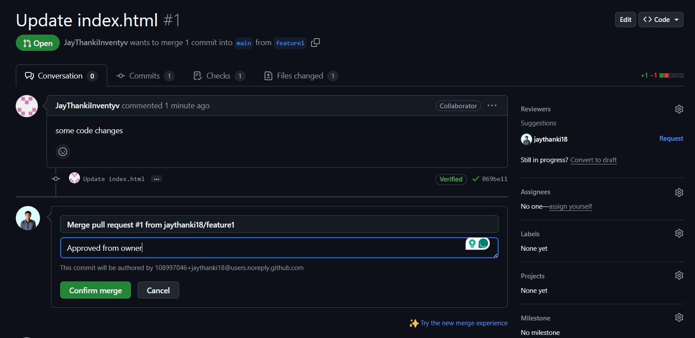

# Git-Training 
## Introduction to Git and GitHub

## What is Git?
**Git** is a distributed version control system designed to handle everything from small to very large projects with speed and efficiency. It helps developers track changes in their code, collaborate with team members, and manage different versions of their projects.

### Key Features

- **Version Control**: Tracks changes to code over time, allowing easy reversion to previous versions when needed.
- **Distributed System**: Each developer has a full copy of the repository, enabling offline work and synchronization when back online.
- **Branching and Merging**: Supports creating separate branches for features, bug fixes, or experiments, which can later be merged back into the main codebase.
- **Collaboration**: Facilitates teamwork through tools like pull requests, code reviews, and conflict resolution.

### What is GitHub?
**GitHub** is a cloud-based platform that hosts Git repositories and provides tools for version control, collaboration, and code management. It allows multiple developers to work together on projects from anywhere in the world, offering features like pull requests, issue tracking, and continuous integration.

### Key Features

- **Repository Hosting**: Store and manage your Git repositories in the cloud.
- **Collaboration**: Work with teams using **pull requests**, **code reviews**, and **issues** for tracking bugs and features.
- **Branch Management**: Easily manage branches and merge them into the main project.
- **Actions & CI/CD**: Automate workflows with **GitHub Actions** for continuous integration and deployment.

### Basic Git Commands

#### Initialize a Repository
- To start a new repository, navigate to your project directory and run:
```bash
git init
```

#### Clone a Repository
- To clone an existing repository from GitHub:
```bash
git clone <repository-url>
```

#### Check Repository Status
- To check the status of your files in the working directory and staging area:
```bash
git status
```

#### Add Files to Staging Area
- To add specific files to the staging area:
```bash
git add <file-name>
```
- To add all files:
```bash
git add .
```

#### Commit Changes
- To commit the staged changes with a message:
```bash
git commit -m "your commit message"
```

#### View Commit History
- To view the commit history:
```bash
git log
```

#### Create a New Branch
- To create a new branch:
```bash
git branch <branch-name>
```

#### Switch to a Branch
- To switch to an existing branch:
```bash
git checkout <branch-name>
```

#### Merge Branches
- To merge a branch into the current branch:
```bash
git merge <branch-name>
```

#### Push Changes to Remote Repository
- To push your changes to the remote repository:
```bash
git push origin <branch-name>
```

#### Pull Changes from Remote Repository
- To pull the latest changes from the remote repository:
```bash
git pull origin <branch-name>
```

# Git Work Flow
Here are some common Git commands used in branching and merging in workflow:

### Create branches
```bash
git branch production
git branch release
git branch dev
git branch featureLogin
git branch featureSignup
```

### Switch to the production branch
```bash
git checkout -b production
```


### Switch to the featureLogin branch
```bash
git checkout -b featureLogin
```

### Make commits on the featureLogin branch
```bash
git commit -m "login functionality added"
```

### Switch to the featureSignup branch
```bash
git checkout -b featureSignup
```

### Make commits on the featureSignup branch
```bash
git commit -m "signup functionality added"
```

### Switch to the dev branch
```bash
git checkout -b dev
```

### Merge the featureLogin branch into dev
```bash
git merge featureLogin
```

### Commit the merge
```bash
git commit -m "feature login test done"
```
### Merge the featureSignup branch into dev
```bash
git merge featureSignup
```

### Commit the merge
```bash
git commit -m "feature signup test done"
```

### Switch to the release branch
```bash
git checkout -b release
```

### Merge the dev branch into release
```bash
git merge dev
```

### Commit the merge
```bash
git commit -m "New version Release-1"
```

### Switch to the production branch
```bash
git checkout -b production
```

### Merge the release branch into production
```bash
git merge release
```

### Commit the merge
```bash
git commit -m "Production 1 published"
```


### Screenshots



## Creating and Managing a Pull Request on GitHub

---
### Step 1: Clone the Repository
Clone the repository to your local machine:
```
git clone <repository-url>
cd <repository-folder>
```
---

### Step 2: Create a New Branch

  Create a new branch for your changes:
   ```bash
   git checkout -b feature/your-feature-name
   ```

### Step 3: Make Changes and Commit
```
echo "This is a feature branch" > example.txt
git add example.txt
git commit -m "Add example.txt to feature branch"
```
### Step - 4: Push The Branch
Push your branch to GitHub:
```
git push origin feature/your-feature-name
```
### Step 5: Set Up Branch Protection
1. Go to your repository on GitHub.
2. Navigate to `Settings` > `Branches` > `Add rule`.
3. Set the branch name pattern to  `feature/*`.
4. Enable:
      - Require a PR before merging.
      - Require 2 approvals.
      - Dismiss stale approvals.
      - Save the rule.


### Step 6: Create a Pull Request
1. Go to the *Pull requests* tab.
2. Click `New pull request`.
3. Set the base branch to `main` and compare branch to your `feature` branch.
4. Add a `title` and `description`, then click Create `pull request`.

### Step 7: Get Approvals
1. Share the PR with collaborators.
2. Request reviews and wait for 2 `approvals`.

### Step 8: Compare the Changes

  ```
    git checkout main
    git pull origin main
  ```
1. Repository owner will review the code and approve the changes
2. After approvals, click `Merge pull request`.
3. Confirm the merge.

## Screenshots
### 1- set rules for pull request



### 2 - in feature branch rules are created


### 3 - code changes 
 

### 3 - compare changes 


### 4 - Review & Approve changes


### 4 - merge pull request

