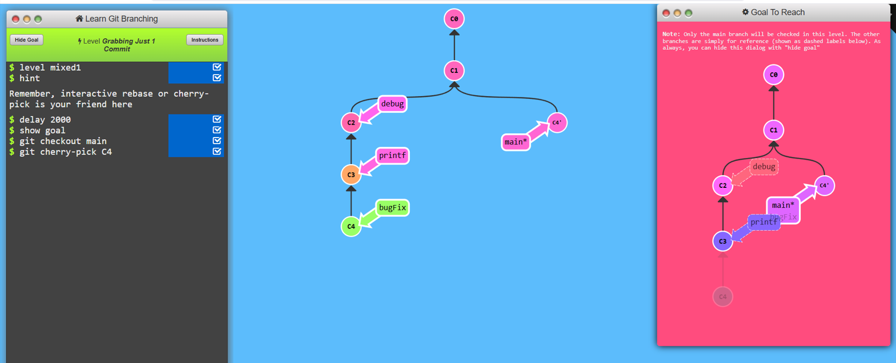
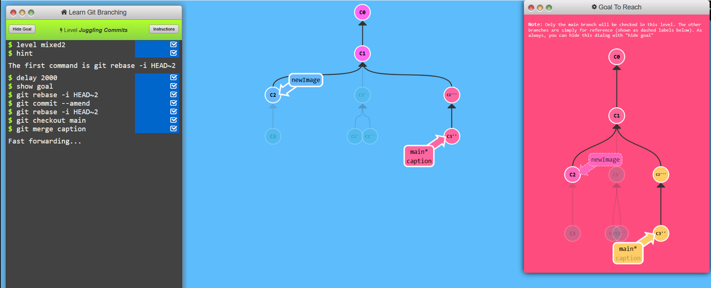
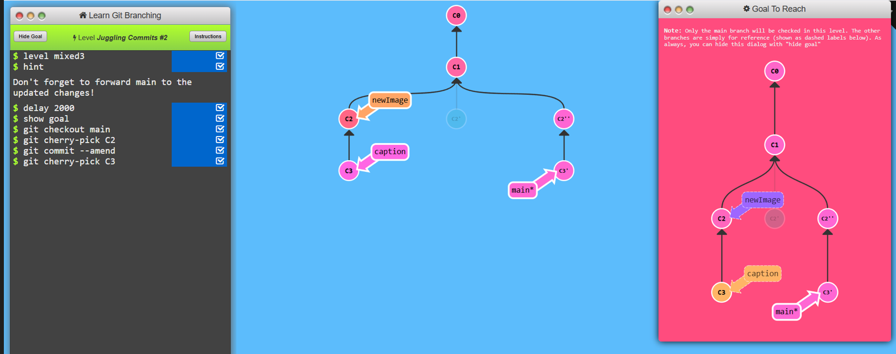
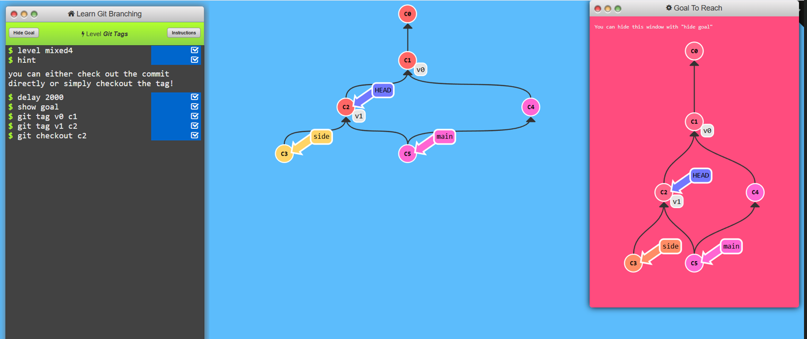

# Level 4: A Mixed bag

## Task 1
```
1. git checkout main
2. git cherry-pick C4 
```


## Task 2
```
1. git rebase -i HEAD~2
2. git commit --amend
3. git rebase -i HEAD~2
4. git checkout main
5. gt merge caption
```


## Task 3
```
1. git checkout main
2. git cherry-pick C2
3. git commit --amend
4. git cherry-pick C3
```


## Task 4
```
1. git tag v0 C1
2. git tag v1 C2 
3. git checkout C2 
```


## Task 5
```
1. git describe C1
2. git checkout C6
3. git checkout bugFix
4. git commit
```
