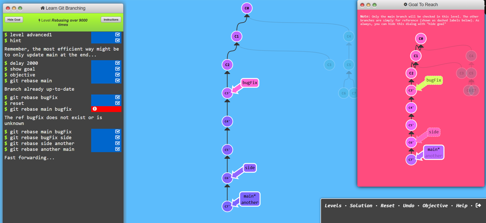
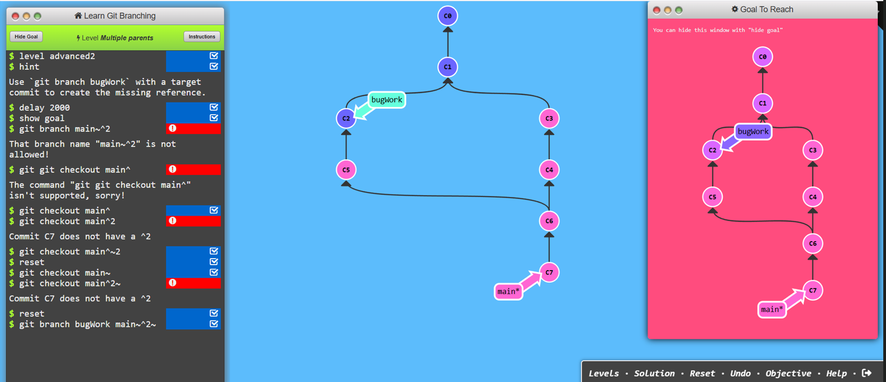
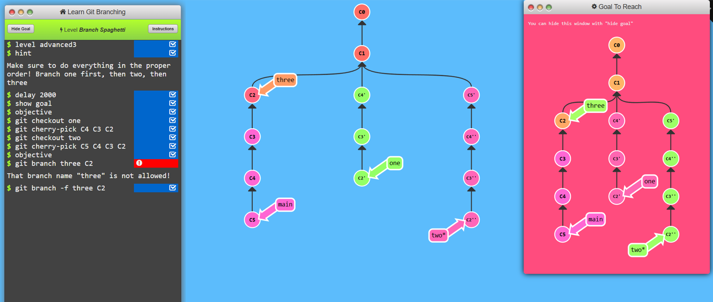
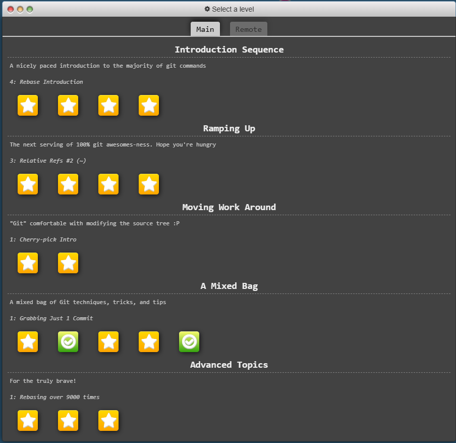

# Level 5: Advanced topics

## Task 1
```
1. git rebase main bugFix
2. git rebase bugFix side
3. git rebase side another
4. git rebase another main
```


## Task 2
```
1. git branch bugWork main~^2~
```


## Task 3
```
1. git checkout one
2. git cherry-pick C4 C3 C2
3. git checkout two
4. git cherry-pick C5 C4 C3 C2
5. git branch -f three C2 
```


# All git task completed
