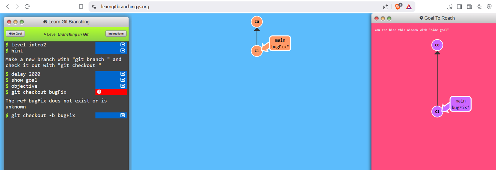
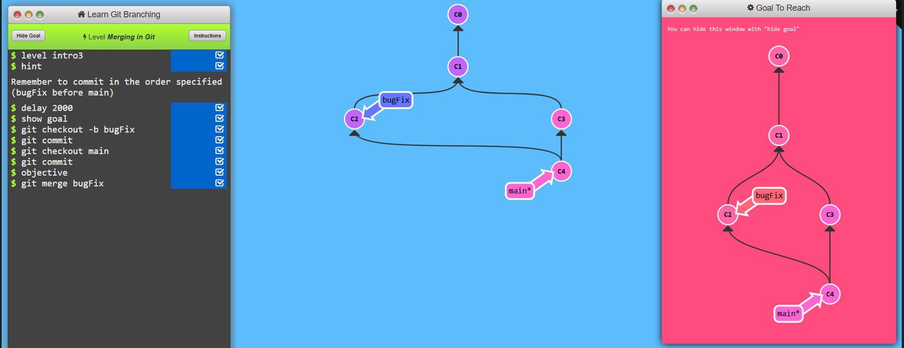
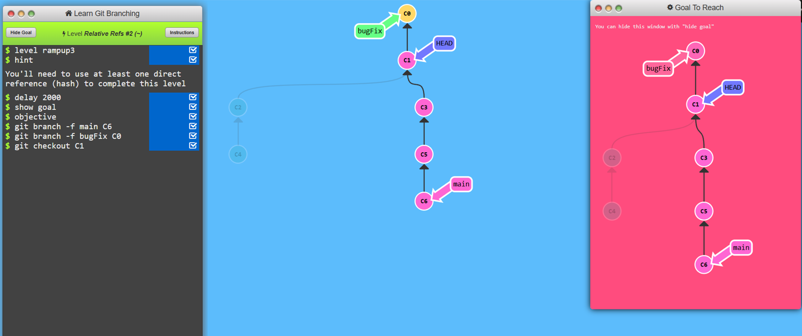
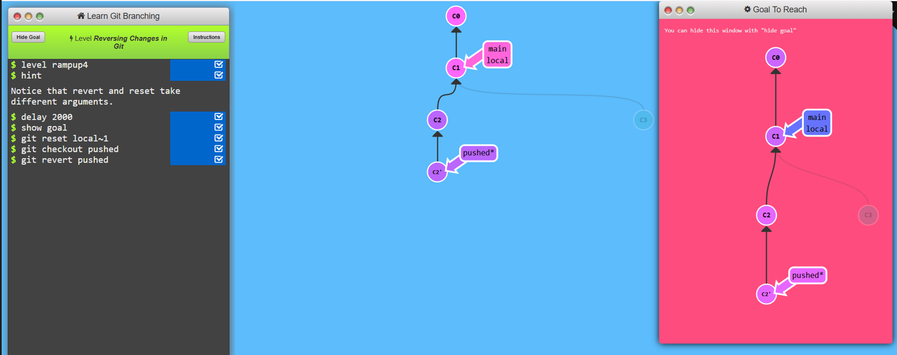

# Learn-Git_Branching

# Level 1: Introduction Sequence

## Task 1
```
1. git commit
```


## Task 2
```
1. git checkout -b bugFix
```



## TASK 3
```
1. git checkout -b bugFix
2. git commit
3. git checkout main
4. git commit
5. git merge bugfix
```


## Task 4
```
1. git checkout -b bugfix
2. git commit
3. git checkout main
4. git commit
5. git chekout bugfix
6. git rebase main
```


# Level 2: Ramping up

## Task 1

```
1. git checkout c4
```


## Task 2
```
1. git checkout c4
2. git checkout c4^
```


## Task 3
```
1. git checkout C2~1
2. git branch -f main C6
3. git branch -f bugFix C1~1
```


## Task 4
```
1. git reset C3^
2. git checkout pushed
3. git revert C2
```


# Level 3: Moving work around

## Task1
```
1. git cherry-pick C3 C4 C7
```


## Task 2
```
1. git rebase -i C5~4
```


# Level 4: A Mixed bag

## Task 1
```
1. git checkout main
2. git cherry-pick C4 
```


## Task 2
```
1. git rebase -i HEAD~2
2. git commit --amend
3. git rebase -i HEAD~2
4. git checkout main
5. gt merge caption
```


## Task 3
```
1. git checkout main
2. git cherry-pick C2
3. git commit --amend
4. git cherry-pick C3
```


## Task 4
```
1. git tag v0 C1
2. git tag v1 C2 
3. git checkout C2 
```


## Task 5
```
1. git describe C1
2. git checkout C6
3. git checkout bugFix
4. git commit
```


# Level 5: Advanced topics

## Task 1
```
1. git rebase main bugFix
2. git rebase bugFix side
3. git rebase side another
4. git rebase another main
```


## Task 2
```
1. git branch bugWork main~^2~
```


## Task 3
```
1. git checkout one
2. git cherry-pick C4 C3 C2
3. git checkout two
4. git cherry-pick C5 C4 C3 C2
5. git branch -f three C2 
```


# All git task completed
