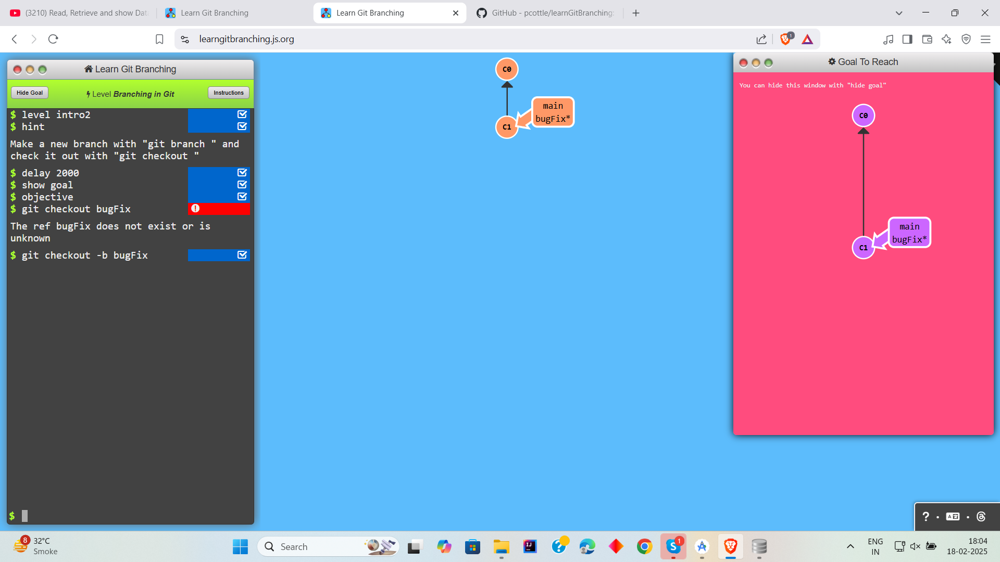

# Learn-Git_Branching

# Level 1: Introduction Sequence

## Task 1
```
1. git commit
```


## Task 2
```
1. git checkout -b bugFix
```



## TASK 3
```
1. git checkout -b bugFix
2. git commit
3. git checkout main
4. git commit
5. git merge bugfix
```


## Task 4
```
1. git checkout -b bugfix
2. git commit
3. git checkout main
4. git commit
5. git chekout bugfix
6. git rebase main
```


