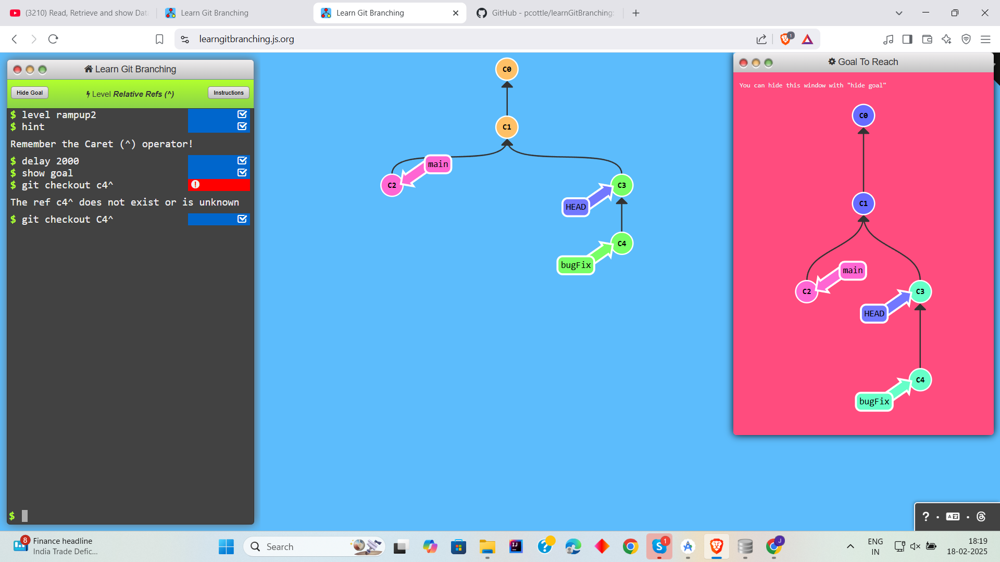
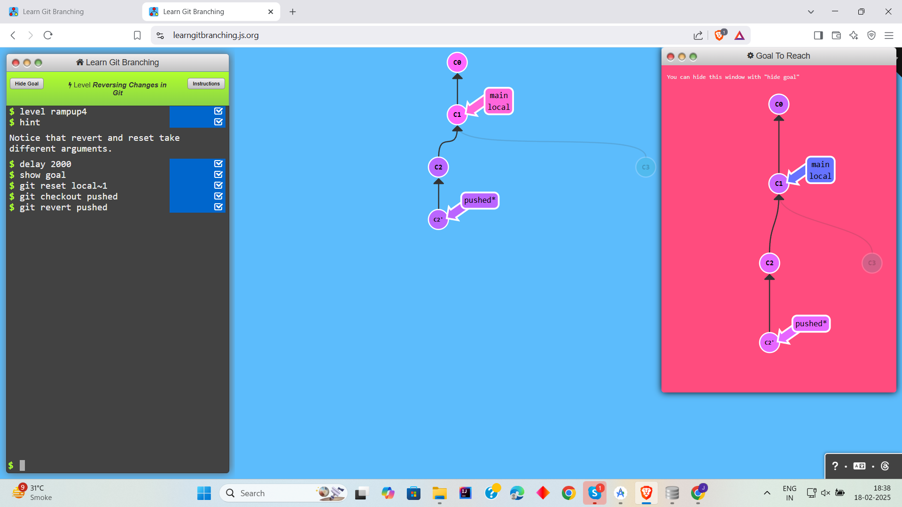

# Level 2: Ramping up

## Task 1

```
1. git checkout c4
```


## Task 2
```
1. git checkout c4
2. git checkout c4^
```


## Task 3
```
1. git checkout C2~1
2. git branch -f main C6
3. git branch -f bugFix C1~1
```


## Task 4
```
1. git reset C3^
2. git checkout pushed
3. git revert C2
```
