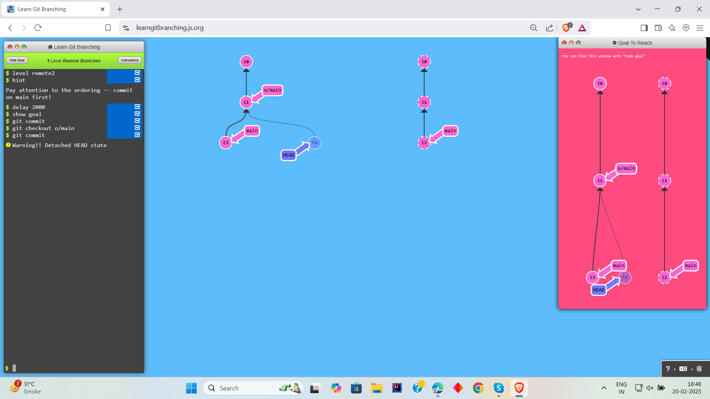

# Learn Git Branching

# Level 1: Push & Pull -- Git Remotes!

## Task 1

```
1. git clone
```


## Task 2
```
1. git commit
2. git checkout o/main
3. git commit
```




## Task 3
```
1. git fetch
```


## Task 4
```
1. git pull
```


## Task 5
```
1. git clone
2. git fakeTeamwork main 2
3. git commit
4. git pull
```


## Task 6
```
1. git commit
2. git commit
3. git push
```


## Task 7
```
1. git clone
2. git fakeTeamwork
3. git commit
4. git pull -rebase
5. git push
```


## Task 8
```
1. git checkout main
2. git reset --hard o/main
3. git checkout -b feature C2
4. git push origin feature
```

