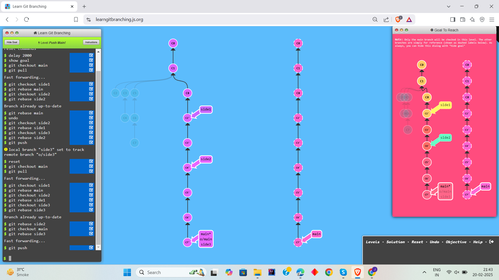
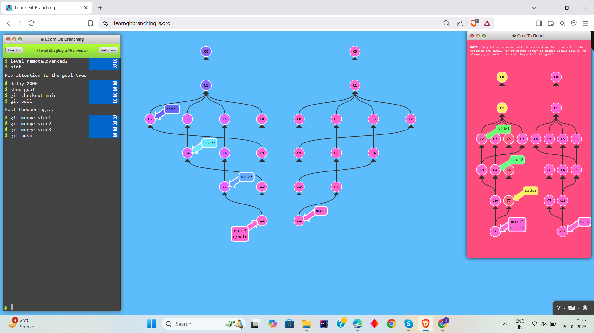
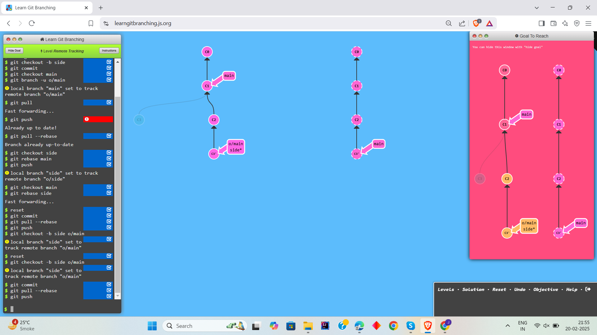
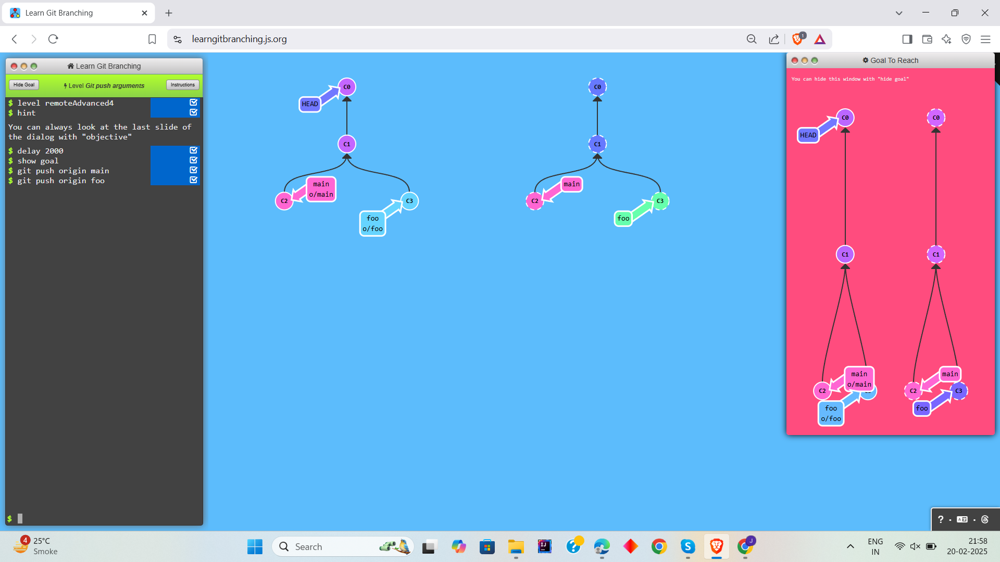
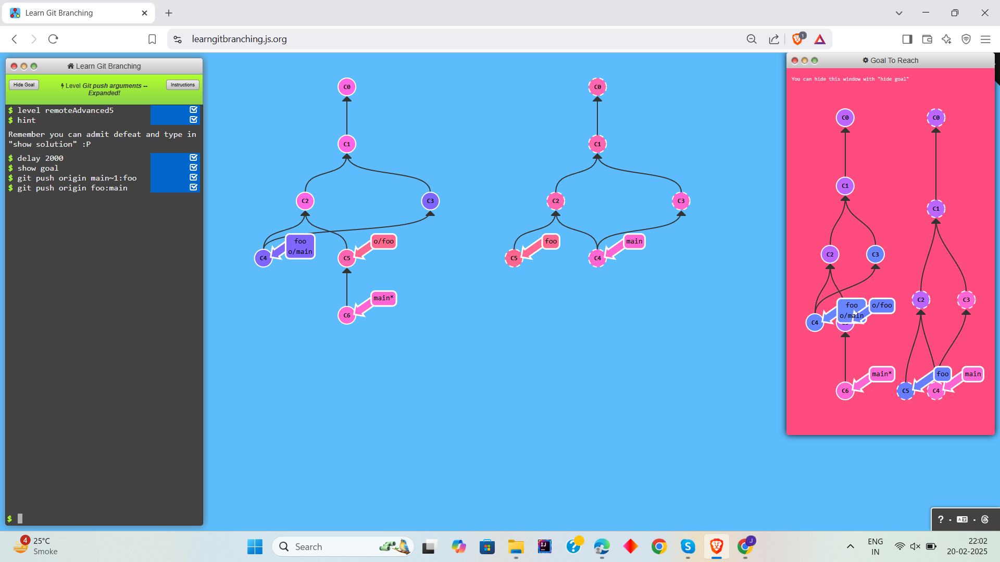
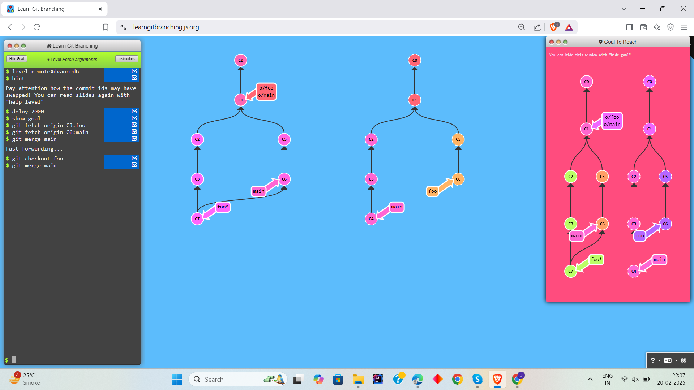
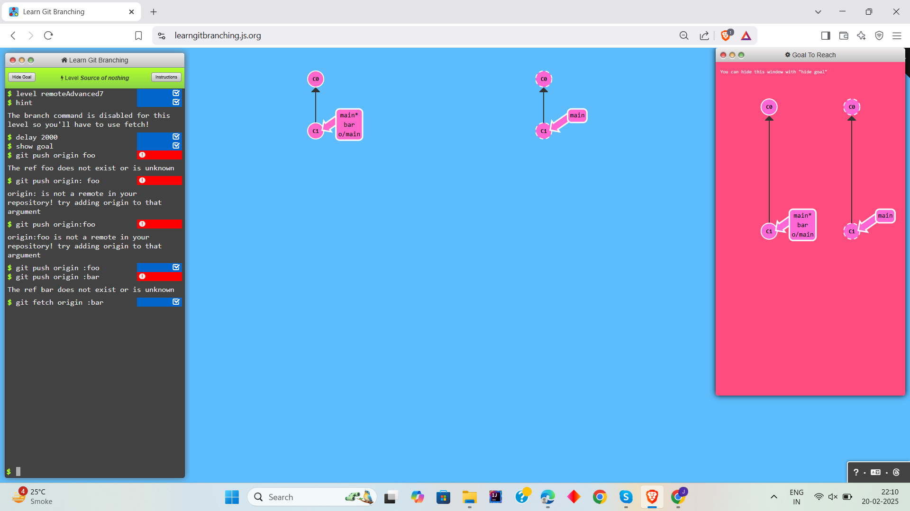
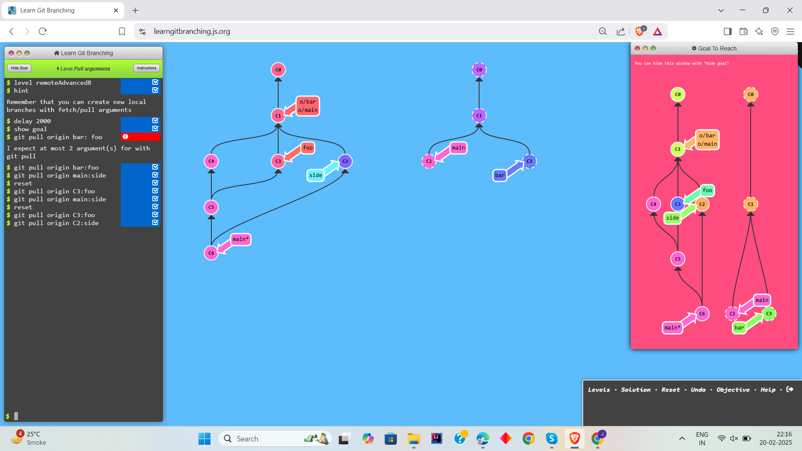
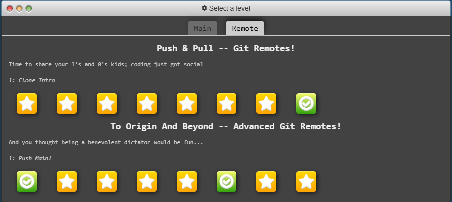

# Learn Git Branching

# Level 1: Advanced Git Remotes!

## Task 1

```
1. git checkout main
2. git pull
3. git checkout side1
4. git rebase main
5. git checkout side2
6. git rebase side1
7. git checkout side3
8. git rebase side2
9. git checkout main
10. git rebase side3
11 git push
```




## Task 2
```
1. git checkout main
2. git pull
3. git merge side1
4. git merge side2
5. git merge side3
6. git push
```




## Task 3
```
1. git checkout -b side o/main
2. git commit
3. git pull --rebase
4. git push
```



## Task 4
```
1. git push origin main
2. git push origin foo
```



## Task 5
```
1. git push origin main~1:foo
2. git push origin foo:main
```



## Task 6
```
1. git fetch origin C3:foo
2. git fetch origin C6:main
3. git merge main
4. git checkout foo
5. git fmerge main
```



## Task 7
```
1. git push origin :foo
2. git push origin :bar
```


## Task 8
```
1. git pull origin C3:foo
2. git pusll origin C2:side
```



# Task Completion

